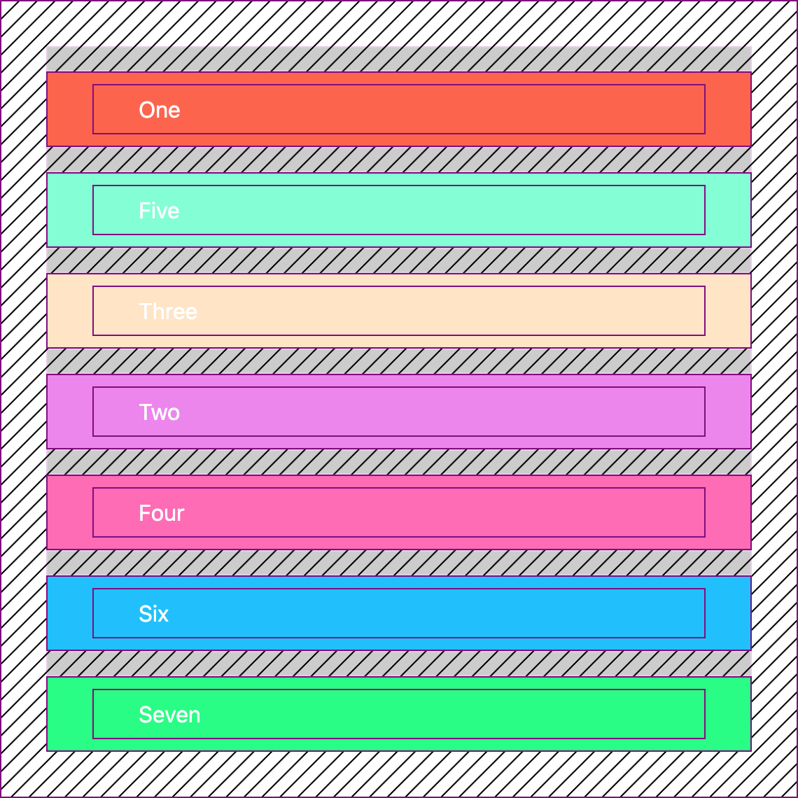

## Svelte Native Drag + Drop

Simple lightweight utlity for handling drag and drop events with W3C API Drag + Drop → [**DEMO**](https://svelte.dev/repl/3be30493605847549ec15ec252030771?version=3.31.2)

<p align="center">
	<a href="https://svelte.dev/repl/3be30493605847549ec15ec252030771?version=3.31.2"></a>
</p>

## Usage

```
npm install --save svelte-native-drag-drop
yarn add svelte-native-drag-drop
```

The store binds to DOM elements, so its important to call `.clear()` with `onDestroy`:

```
<script>
	import { onMount, onDestroy } from 'svelte';
	import dragdrop from './index.js'

	onDestroy( async () => {
		dragdrop.clear('shared-group')
	})

</script>

```

There are two core functions: binding to **drag** areas, binding to **drop** areas:

```
<script>
	import { onMount, onDestroy } from 'svelte';
	import dragdrop from './index.js'

	onMount( async () => {
		dragdrop.addDragArea( 'shared-group', handleEl, dragEl )
		dragdrop.addDropArea( 'shared-group', dropEl )
	})

	let dropEl, dragEl, handleEl

</script>

<div bind:this={dropEl}>
	drop area
</div>

<div bind:this={dragEl}>
	<div bind:this={handleEl}>drag handle</div>
	<span>drag element</span>
</div>

```

The store holds two references to the currently active DOM elements, `source` and `destination`:

```
{#if $dragdrop['shared-group'].source == dragEl} dragged! {/if}
{#if $dragdrop['shared-group'].destination == dropEl} dropping! {/if}

```

Callbacks can be passed to the `addDropArea` function:

```
<script>
	import { onMount, onDestroy } from 'svelte';
	import dragdrop from './index.js'

	onMount( async () => {

		const callbacks = {
			dragover: ( e ) => console.log('currently dragging over:', e.target),
			dragleave: ( e ) => console.log('dragging left:', e.target),
			drop: ( e ) => console.log('successfully dropped, source:', e.source, 'destination:', e.destination)
		}

		dragdrop.addDragArea( 'shared-group', handleEl, dragEl )
		dragdrop.addDropArea( 'shared-group', dropEl, callbacks )
	})

	let dropEl, dragEl, handleEl

</script>

<div bind:this={dropEl}>
	drop area
</div>

<div bind:this={dragEl}>
	<div bind:this={handleEl}>drag handle</div>
	<span>drag element</span>
</div>

<div>
	status:
	{#if $dragdrop['shared-group'].source == dragEl} dragged! {/if}
	{#if $dragdrop['shared-group'].destination == dropEl} dropping! {/if}
</div>

```